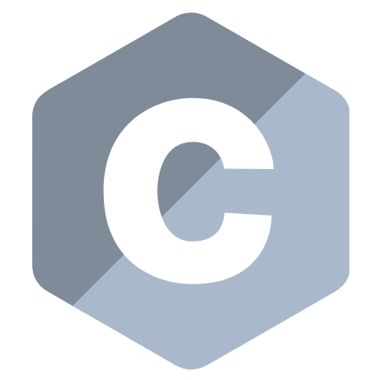
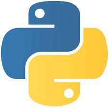

# HI I'm Łukasz Chmielewski 

## Few words about me
I'm a student of AGH at the faculty of IT.
Languages which I know a little or little more:
 

  
  
  
  

 
My page: https://ukasz11233.github.io/

